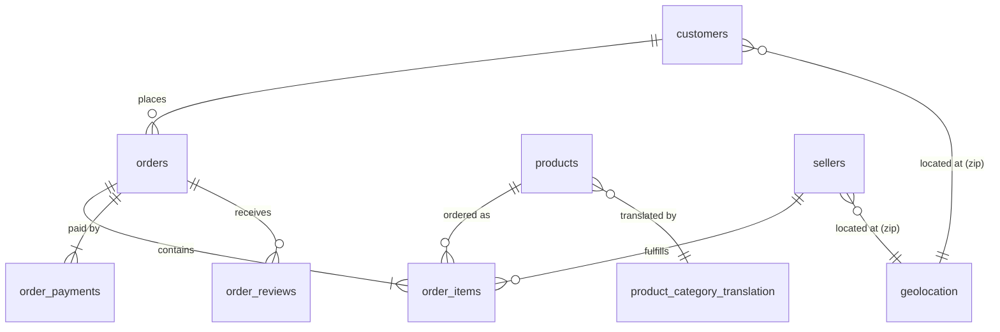
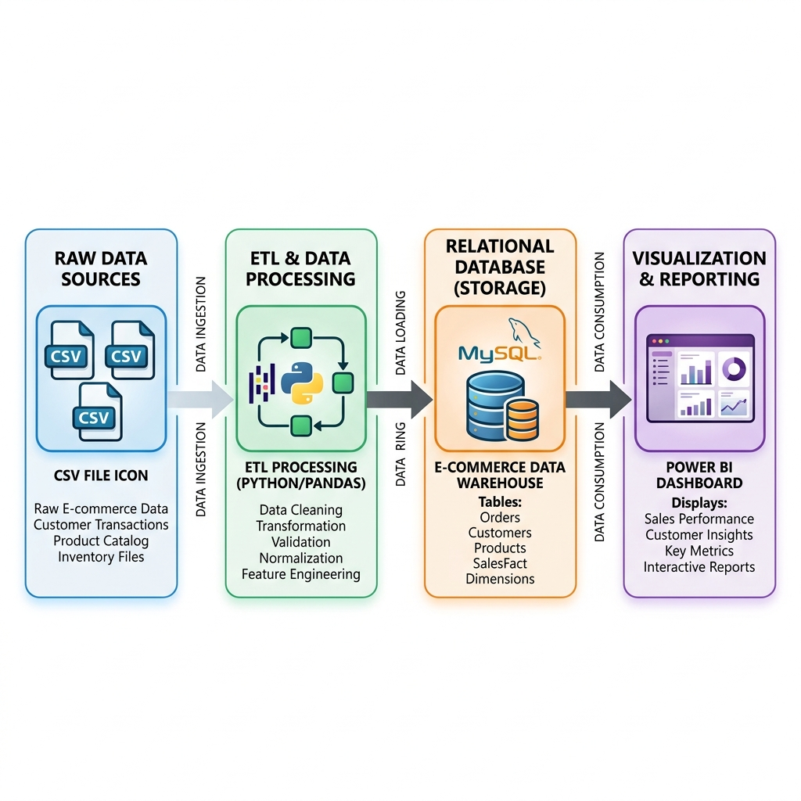

# E-Commerce Sales & Customer Analytics Dashboard
### End-to-End Data Analyst Portfolio Project (Olist Brazilian Dataset)

---

## 1. Project Overview & Business Problem

**Olist** is the largest department store SaaS connecting small, independent merchants across Brazil to national e-commerce channels. Although Olist enables scale, operating a multi-tenant department marketplace introduces substantial logistical, marketing, and customer relationship challenges:

1. **Low Customer Retention**: Transactional data shows a critical **96.8% single-purchase rate**, meaning Olist operates on a high-acquisition, low-loyalty model.
2. **Logistics & Delivery Inefficiencies**: Delivery times vary heavily by region (ranging from 8 days in Sao Paulo to 25+ days in Northern states). Logistics delays are the primary driver of negative customer reviews.
3. **Seller Quality Control**: Low-performing sellers (under 3.5 stars) drive disproportionate customer service costs and brand damage.

This project delivers a complete **Data Analytics Pipeline**—including a Python ETL and feature engineering workflow, a MySQL relational schema with 26 analytical queries, and a Power BI layout specification—to translate raw operational records into strategic C-suite decision support.

---

## 2. Relational Schema & ER Diagram

The Olist database consists of transactional fact tables surrounded by customer, seller, and product dimensions:



---

## 3. Data Flow Architecture

The data processing flows from raw files to executive-level reporting:



1. **Ingest (Raw)**: Raw Kaggle CSV tables are stored in `data/raw/`.
2. **Clean & Preprocess**: Pandas handles missing values, date formatting, duplicate geolocation resolution, and English category translations.
3. **Feature Engineering**: Python calculates RFM customer segments, Customer Lifetime Value (CLV), carrier transit speeds, and seller ranking scores. Cleaned files are saved to `data/cleaned/`.
4. **Relational Load**: Cleaned tables are loaded into a normalized MySQL schema.
5. **Business SQL Analytics**: Views and 26 advanced analytical queries calculate revenue momentum, regional late rates, and satisfaction correlations.
6. **BI Dashboard**: Power BI imports views to visualize KPIs and insights.

---

## 4. Directory Structure

```
Ecommerce-Analytics/
│
├── data/
│   ├── raw/                           # Raw source CSV files
│   └── cleaned/                       # Cleaned master datasets
│
├── notebooks/
│   ├── 01_data_understanding.ipynb    # Data profiling & dictionaries
│   ├── 02_data_cleaning.ipynb         # Null/Duplicate handling & conversions
│   ├── 03_feature_engineering.ipynb    # Metrics calculations (RFM, CLV, Lag)
│   ├── 04_eda.ipynb                   # Visualization plots
│   └── 05_business_insights.ipynb     # Executive KPI console
│
├── sql/
│   ├── schema.sql                     # Table creations, keys, & indexes
│   ├── data_import.sql                # LOAD DATA SQL & Python bulk-loader
│   ├── views.sql                      # SQL views for BI connectivity
│   └── business_queries.sql           # 26 business intelligence queries
│
├── powerbi/
│   └── README.md                      # DAX measures and page wireframes
│
├── reports/
│   ├── business_insights_report.md    # 15 consulting-style strategic insights
│   └── career_optimization.md         # Resume, LinkedIn, & Interview Q&As
│
├── dashboard_screenshots/              # Generated plot files (PNG)
│   ├── customer_segmentation.png
│   ├── delivery_time_distribution.png
│   ├── delivery_vs_rating_correlation.png
│   ├── monthly_revenue_trend.png
│   ├── revenue_by_category.png
│   └── revenue_by_state.png
│
├── README.md                          # Main repository index
├── requirements.txt                   # Project dependencies
└── architecture_diagram.png           # Visual architecture diagram
```

---

## 5. Ingestion & Installation Guide

### Step 1: Clone the Repository & Install Dependencies
Ensure Python 3.8+ is installed.
```bash
git clone https://github.com/yourusername/Ecommerce-Analytics.git
cd Ecommerce-Analytics
pip install -r requirements.txt
```

### Step 2: Run the Data Processing Pipeline
Execute the notebook runner to clean, map, and output data assets:
```bash
python generate_notebooks.py
```
This generates the `.ipynb` notebooks inside `notebooks/`, aggregates files into `data/cleaned/`, and outputs static charts inside `dashboard_screenshots/`.

### Step 3: Initialize the MySQL Database
1. Connect to your local MySQL instance.
2. Execute `sql/schema.sql` to initialize tables, relationships, and performance indexes:
   ```sql
   SOURCE sql/schema.sql;
   ```
3. Use the Python bulk ingestion script provided inside `sql/data_import.sql` (under Method B) to load the cleaned CSVs into MySQL without hitting security blockades like `local_infile`.

### Step 4: Load Views & Run Business Queries
Create analytical views for BI connectivity:
```sql
SOURCE sql/views.sql;
```
Test any of the 26 analytical queries located in `sql/business_queries.sql`.

---

## 6. Executive Business Console KPIs

*Total metrics captured across the Olist platform (2016-2018):*

- **Total Gross Revenue**: 15.86M BRL
- **Total Orders**: 99.4K
- **Unique Active Customers**: 96.1K
- **Average Order Value (AOV)**: 159.60 BRL
- **Average Review Score**: 4.08 / 5.0
- **Overall Late Delivery Rate**: 7.84%

---

## 7. Key Strategic Insights

Below are selected high-impact findings (the full list of 15 consulting-style recommendations is available in [business_insights_report.md](reports/business_insights_report.md)):

* **Logistics Penalizes Brand Score**: Orders delivered on time maintain a strong average rating of **4.3 stars**, whereas delayed shipments plummet to **2.2 stars**. Delayed freight represents the single largest driver of low scores.
* **The Single-Purchase Trap**: Over **96.8% of customers only buy once**. Implementing post-purchase marketing sequences (e.g., offering a 15% coupon valid for 30 days) is highly recommended.
* **Geographical Hotspots**: SP, RJ, and MG generate **70% of total platform revenue**. Digital advertising and logistics investments should be concentrated in these regional hubs.
* **The VIP Tier Leverage**: The "Champions" customer segment represents only 4% of customer volume but contributes **18% of platform revenue**, reinforcing the value of establishing a VIP loyalty program.

---

## 8. Power BI Dashboard Layout Specs

The dashboard utilizes a premium **dark theme** and is divided into four functional views (detailed DAX measures are documented in [powerbi/README.md](powerbi/README.md)):

1. **Executive Summary**: Core sales trends, state sales distributions, category Pareto chart, and top-level KPIs (Revenue, Orders, AOV, Ratings).
2. **Customer Loyalty**: Customer segmentation (RFM), purchase frequency distributions, and a ranked list of VIP customers by CLV.
3. **Product Analytics**: Best-selling items, category revenue ranks, and freight-to-price scatter plot analysis.
4. **Logistics & Satisfaction**: Delivery days trend, regional late rates, and ratings-to-delay correlation bar charts.

---

## 9. Career Inquiries & Interview Readiness

This repository includes career-ready assets to prepare for Data Analyst interviews:
- **ATS Resume Bullets**: Optimized keywords highlighting ETL, SQL modeling, and dashboard creation.
- **20 Interview Questions**: 10 technical (SQL/Python) and 10 behavioral (STAR format) questions based on this dataset.
- Refer to [career_optimization.md](reports/career_optimization.md) for full descriptions and answers.
